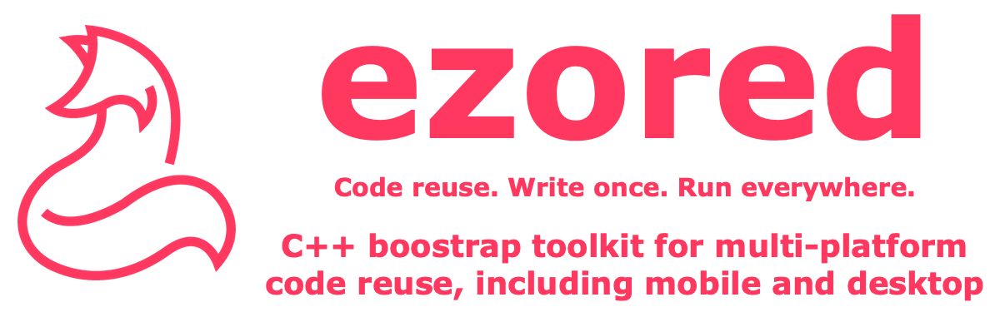

# ezored server

## About

Sample project using **ezored** to build a server application (http, tcp and websocket).

## Supported platforms:

1. macos
2. linux
3. windows

Obs: Generally any platform with C++ support will work too, like smart tvs and embeded hardwares.

## Requirements:

1. Check [ezored](https://github.com/ezored/ezored) project for general requirements.

## How to use:

1. Clone reposity:  
    > git clone git@github.com:ezored/ezored-server.git

2. Enter on cloned folder:  
    > cd ezored-server

3. The other commands is the same of any **ezored** project:  
    https://github.com/ezored/ezored    

## TODO:

- [X] http server
- [ ] websocket server
- [ ] tcp server

## Supported By Jetbrains IntelliJ IDEA

## License

[MIT](http://opensource.org/licenses/MIT)

Copyright (c) 2019-present, Paulo Coutinho
